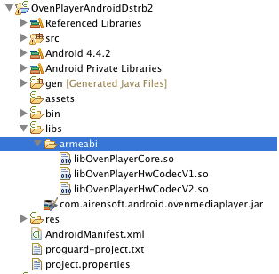
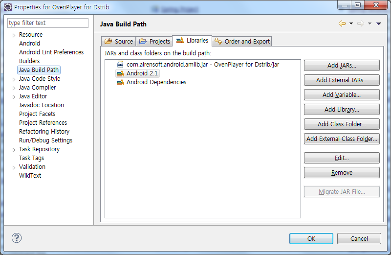

.. raw:: pdf

   PageBreak

.. _install:

*********************************
설치 및 사용방법
*********************************

다운로드
------------------------------------------------------
`Github OvenPlayer-SDK-for-Android <https://github.com/AirenSoft/OvenPlayer-SDK-for-Android>`_ 에서 최신 SDK를 받으십시오. 최종 바이너리는 다음과 같이 구성되어 있습니다.

.. csv-table:: 라이브러리 구성
	:header: "파일명", "필수여부", "설명"
	:widths: 35, 18, 50

	"libOvenPlayerCore.so", "O", "미디어 플레이어 Native 라이브러리"
	"libOvenPlayerHWCodecV1.so", "X", "안드로이드 2.X를 위한 하드웨어 코덱 모듈"
	"libOvenPlayerHWCodecV2.so", "X", "안드로이드 3.X를 위한 하드웨어 코덱 모듈"
	"libOvenPlayerHWCodecV3.so", "X", "안드로이드 4.X를 위한 하드웨어 코덱 모듈"
	"com.airensoft.android.Oven.jar", "O", "Java 인터페이스"

라이브러리 등록
------------------------------------------------------
프로젝트의 libs\\armeabi 에 .so 파일을 등록하십시오. 

.so 파일을 등록한 후에는 JAR 파일을 Java Build Path에 등록해야 합니다. Menu -> Project -> Properties를 선택한 뒤 Add Jar 버튼을 클릭하여 com.airensoft.android.Oven.jar 파일을 등록하십시오. 

Android Menifest 정의
------------------------------------------------------
스트리밍 기능을 사용하기 위해서는 INTERNET 권한을 추가하고, 로컬 미디어 파일을 재생하기 위해서는 WRITE_EXTERNAL_STORAGE 권한을 추가하십시오. 

.. code-block:: xml

	<uses-permission android:name="android.permission.INTERNET" />			
	<uses-permission android:name="android.permission.WRITE_EXTERNAL_STORAGE" />
