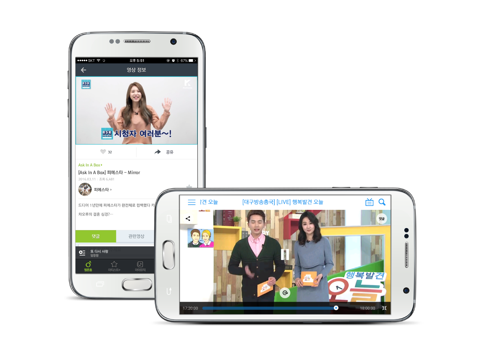

.. _intro:

======================================================
소개
======================================================

OvenPlayer SDK for Android 는 50개 이상의 서비스를 통해 3000만대 이상의 기기에서 5년간 안정적으로 동작한 검증된 플레이어 SDK 이며, 사용자에게 최고의 미디어 경험을 제공할 수 있는 가장 좋은 플레이어 솔루션 입니다. OvenPlayer SDK for Android 는 로컬 파일을 재생하는 것 뿐만 아니라 RTMP, HLS, RTSP, HTTP와 같은 다양한 스트리밍 프로토콜을 지원합니다. 

기능
------------------------------------------------------
* HLS, RTMP, RTSP, HTTP 프로토콜
* MP4/H.264, AAC, MP3, Flac(안드로이드 4.0 이상) 지원 - 하드웨어 디코더
* HLS의 AES 암호화
* 오디오 전용 재생
* 로컬 파일 재생
* 로컬 캐시
* HLS ID3 Timed Meta, RTMP Metadata 
* 배속 재생
* 쉬운 UI 통합

장점
------------------------------------------------------
* 광범위한 안드로이드 장치를 지원합니다.
* 안드로이드 2.3.3부터 HLS로 라이브 방송을 재생할 수 있습니다.
* RTMP 프로토콜을 사용하여 라이브 중계를 3초 미만의 저지연으로 재생할 수 있습니다.
* 신규 단말을 빠르게 지원합니다.
* 50개 이상의 서비스를 통해 3천만개 이상의 기기에서 안정성이 검증된 플레이어 입니다.

동작 환경
------------------------------------------------------
* Android 2.3.3 (API 10) 이상

라이선스 및 유료 정책
------------------------------------------------------
* 이 프로그램에 포함된 비디오 디코더는 `FFmpeg <http://ffmpeg.sourceforge.net>`_ 을 사용하여 제작하였으며, FFmpeg의 라이선스는 `LGPL <http://www.gnu.org/licenses/old-licenses/lgpl-2.1.html>`_ 을 따릅니다. LGPL에 따른 변경된 소스 코드 및 오브젝트는 `Github : OvenPlayer-SDK-for-Android  <https://github.com/AirenSoft/OvenPlayer-SDK-for-Android>`_ 에 공개되어 있습니다.
* 본 플레이어는 비영리 목적으로 사용하는 모든 개인 개발자는 무료로 사용할 수 있습니다. 비영리 목적으로 사용한 개인 개발자라도 본 SDK를 적용한 최종 결과물(App)이 기업/영리/비영리법인/공공기관/교육기관/기타단체을 목적으로 개발되었다면 무료 대상에 포함되지 않습니다. 
* 본 플레이어가 최종 사용되는 기업/영리/비영리법인/공공기관/교육기관/기타단체는 프로그램을 배포하기 전에 구매를 진행해야 합니다. 자세한 내용은 :ref:`paid-policy` 표와 같습니다. 
* AirenSoft는 OvenPlayer SDK for Android에 대한 기술 지원 프로그램을 운영하고 있으며 자세한 내용은 :ref:`tech-support-plan` 표와 같습니다.

.. _paid-policy:

.. csv-table:: 유료 정책
	:header: "종류", "대상", "사용기간", "기술지원", "가격"
	:widths: 10 , 40 , 10 , 10 , 10

	"무료", "비영리 목적의 개인", "무제한", "없음", "무료"
	"월 구독","기업/영리/비영리법인/공공기관/교육기관","가입기간","가입기간","`문의 <mailto:support@airensoft.com>`_"
	"영구","기업/영리/비영리법인/공공기관/교육기관","무제한","1년 포함","`문의 <mailto:support@airensoft.com>`_"

.. _tech-support-plan:

.. list-table:: 기술 지원 프로그램
	:widths: 15 65

	* - 대상
	  - OvenPlayer SDK for Android 구매 기관 및 단체
	* - 마이너 업데이트
	  - 신규 단말 지원, 버그 패치 등
	* - 매이저 업데이트 
	  - 신규 기능 및 성능 개선 등
	* - 기술 문의
	  - 24시간 이내 응답(주말 및 공휴일 제외) | 횟수 무제한 | 전화, 이메일, 커뮤니티
	* - 기간 연장
	  - support@airensoft.com 으로 문의
	

다운로드
------------------------------------------------------
* `Github OvenPlayer-SDK-for-Android <https://github.com/AirenSoft/OvenPlayer-SDK-for-Android>`_